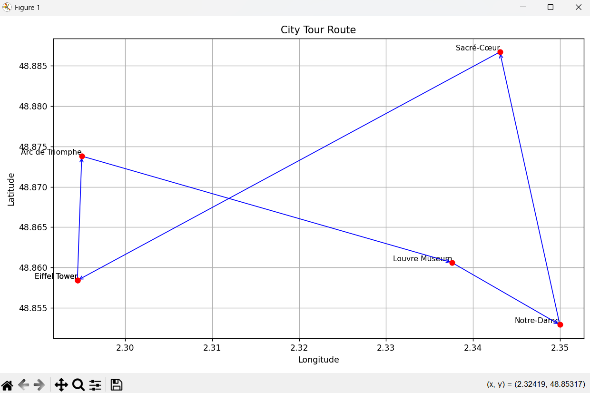

# 🗺️ City Tour Optimizer (TSP)

A Python tool to find the **shortest possible route** through a list of cities or landmarks, using classic **Travelling Salesman Problem (TSP)** algorithms.

---

## 🚀 Features

✅ CSV-based place input (name, lat, lon, opening hours)  
✅ Distance matrix using geodesic (Haversine) math  
✅ Multiple optimization algorithms:  
&nbsp;&nbsp;&nbsp;&nbsp;• `greedy` (fast)  
&nbsp;&nbsp;&nbsp;&nbsp;• `2opt` (optimized)  
&nbsp;&nbsp;&nbsp;&nbsp;• `simulated-annealing` (advanced, global search)  
✅ Command-line interface (CLI)  
✅ GeoJSON route export for map apps (like Google Maps)  
✅ Matplotlib route plotting  
✅ Time-window filtering (`--open-from`, `--open-until`)  
✅ Stats logging (`logs/route_stats.log`)

---

## 📁 Project Structure
```
City_Tour_Optimizer/
├── data/
│ └── places.csv # Input data (places to visit)
├── output/
│ └── route.geojson # Exported route as GeoJSON
│ └── route_plot.png # Route visualized on a map
├── logs/
│ └── route_stats.log # Execution log (algo, time, distance)
├── .venv/ # Virtual environment (ignored by Git)
├── tsp.py # Main entry script (CLI)
├── utils.py # Data model, CSV parsing, plotting
├── distance.py # Haversine distance calculations
├── tsp_solver.py # Greedy, 2-opt, and simulated annealing logic
├── geojson_writer.py # GeoJSON file generator
├── requirements.txt # Python package dependencies
└── README.md # This file
```

---

## 🧾 Input Format (`places.csv`)

```csv
Name,Lat,Lon,Open,Close
Eiffel Tower,48.8584,2.2945,09:00,23:00
Louvre Museum,48.8606,2.3376,10:00,18:00
Notre-Dame,48.8529,2.3500,08:00,20:00
Arc de Triomphe,48.8738,2.2950,10:00,22:00
Sacré-Cœur,48.8867,2.3431,09:00,18:00
```

## 📦 Setup

### Clone the repo
```
git clone https://github.com/your-username/city-tour-optimizer.git
cd city-tour-optimizer
```

### Create and activate virtual environment
```
python -m venv .venv
.venv\Scripts\activate        # Windows
Or:
source .venv/bin/activate     # macOS/Linux
```

### Install dependencies
pip install -r requirements.txt

### Run the Tool
python tsp.py --csv data/places.csv --start "Eiffel Tower" --return-to-start --algo 2opt --plot

## 🧾 Sample Output
   
📍 Computing route using 'simulated-annealing' algorithm...

🧭 Optimal Tour:
1) Eiffel Tower
2) Arc de Triomphe
3) Louvre Museum
4) Notre-Dame
5) Sacré-Cœur
6) Eiffel Tower

📏 Total Distance: 14.94 km
```
📝 Stats logged to: C:\Users\prath\OneDrive\Documents\Projects\City_Tour_Optimizer\logs\route_stats.log
🗺️  GeoJSON route saved to: output\route.geojson
✅ Route written to: C:\Users\prath\OneDrive\Documents\Projects\City_Tour_Optimizer\output\route.geojson
📸 Route plot saved to: output/route_plot.png
```

## 📸 Screenshots

### 📊 Route Plot Example



## 🗺️ [Preview route in geojson.io](https://geojson.io/)

## 📄 License
This project is open-source under the MIT License.

## 👨‍💻 Author
Developed by Mr-047

A project built to explore real-world applications of Python, optimization algorithms, and geospatial data
